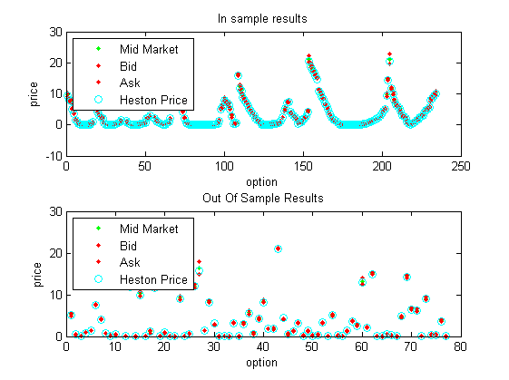
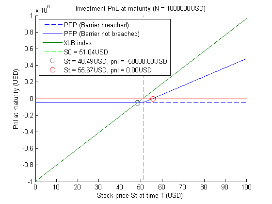

# Structuring of a PPPN Under the Heston Model

This project contains a paper that describes both the structuring and hedging process of a Partially Principal Protected Note under the Heston model: View `paper/Principal Protected Note.pdf`. Additionally, all the necessary demo files have been added in such a way that the reader can reproduce all results locally. The paper provides the necessary details that are required to understand the technical implementation details of the demo: View `PPPN.m` for the demo entrance point.

Also view the [Heston calibration toolkit](https://github.com/VermeirJellen/FinancialEngineering/tree/master/Heston%20Calibration): The functionality of this subproject is copied here in order to remain consistent with the paper.

## Paper Abstract
In this paper we describe the structuring process of a Partially Principal Protected
Note (PPPN). A PPPN is a structured product on an index and delivers
one final payment to investors at maturity date T. The payoff of the structure at time
T can be explained as follows:

- payout = 95%N + p x N x max((ST-S0)/S0, 0), if barrier B is never breached during the lifetime of the product.
- payout = 95% x N , if barrier B is breached during the lifetime of the product.

where N is the amount invested in the product, S0 is the initial value of
the underlying instrument at time 0, ST is the value of the underlying at maturity
and B is the barrier level of the product. The premium p x N x ((ST-S0)/S0)+ is calculated as the initial investment N multiplied by the participation rate p and the positive index return over the period [0; T]. This premium is only
paid when the stock price never went below B during the lifetime of the product.

The paper is structured as follows: We start out by giving a general high level overview of the structured product and its properties. The goal here is to sell the product to investors while providing all necessary information about its risk/return characteristics. Next, we offer a more technical explanation about the actual structuring process. We show that the product can be structured by splitting it in a bankaccount position and an exotic option position. Hence, In order to price our PPPN correctly we must obtain a fair price for the underlying exotic option. In this paper we perform the pricing under Heston and we calibrate the Model on the available index vanilla option market prices. A number of performance optimization and robustness techniques are also discussed in this context. Once we obtain satisfactory model parameters, we apply a monte carlo approach in order to obtain a fair price for the exotic. Additionally, we also analyze some relevant variance reduction techniques. In the third and final section of the paper we focus our attention on the hedging aspect of the product. We discuss a dynamic hedging approach and illustrate how to obtain a Greek neutral portfolio at inception.

## Product Overview
The product that we sell to the investors is a partially principal protected note with index XLB as the underlying. The derivative will be issued on May 19th 2015 and it will be sold for N = 1000000$. The maturity date T of the product is set to be 1st of March 2017. The current stock price of XLB at time T0 is 51.04 and the index offers an annualized dividend payout of 1.45%. The payout structure is defined as above, with the barrier set at 70% of the initial price at 35.7280$. The participation rate p is defined to be 55.35%. The risk free bank account rate for maturity T is 0.51%. This rate and other rates can be obtained via cubic interpolation of the US yield curve

The required information of the market options can be found in the `./optiondata` directory.

## Calibration and Hedging Results
### Cross-Validated Heston Calibration Output

Calibrated HestonParameters:

- kappa: 3.1953 
- eta: 0.0468 
- theta: 0.5427 
- rho: -0.8932 
- sig0: 0.1147 

 
## Pricing of the PPN

Monte Carlo Heston pricing (using anti-thetic stock paths and variance reduction techniques):

- Price: 4.5070
- 95 percent confidence interval: 0.0263
- In our calculations we use 4.5000 as our DOBC price

Structuring process:

- Notional is 1000000USD
- We put 941416.05USD on the bankaccountWe take 10000.00USD as our profitmargin
- We now have 48583.95USD left to buy DOBC options
- From this amount we can buy 10796 DOBC options
- This corresponds to a participation rate of 0.5510
- Investor pnl at maturity is plotted on the graph

## Hedging of the PPPN

The black scholes implied volatility for our exotic option -given the Heston price as input- is 0.18. The greeks of the DOBC under the BS model are as follows:

- Delta = 0.5102
- Gamma = 0.0304
- Theta = -1.0790
- Vega = 26.0924

Total exposure to hedge for shorting the PPPN containing 10796 DOBC options:

- Delta = 5508.2553
- Gamma = 328.6543
- Theta = -11649.3799
- Vega = 281693.9770

We consider following hedging instruments:

- OTM put, K=48.5, T=38 days. price=0.2550,Delta=-0.1702,Gamma=0.0926,Theta=-3.4468,Vega=4.1687
- ATM call, K=51, T=241 days. price=2.2900,Delta=0.4939,Gamma=0.0630,Theta=-1.5397,Vega=16.3879
- OTM call, K=65, T=612 days. price=0.4150,Delta=0.0983,Gamma=0.0179,Theta=-0.4420,Vega=11.3773
- OTM put, K=45, T=122 days. price=0.4050,Delta=-0.1312,Gamma=0.0364,Theta=-1.9501,Vega=6.2739
- Stock. price=51.0400,Delta=1.0000,Gamma=0.0000,Theta=0.0000,Vega=0.0000

##### Delta hedging with the Stock
- We buy 5508.26 stocks
- We borrow an additional 232559.38USD in order to finance the stock purchase
- Total exposure for the combined portfolio:
	- pnl = 0.0000
	- Delta = 0.0000
	- Gamma = -328.6543
	- Theta = 10467.6658
	- Vega = -281693.9770

##### Delta Vega hedging with ATM call and stock
We buy -2980.66 stocks
We buy 17189.19 ATM call options
We have 161351.40USD left to put on the bankaccount
Total exposure for the combined portfolio:
pnl = 0.0000
Delta = 0.0000
Gamma = 753.9606
Theta = -13997.1258
Vega = 0.0000

##### Detal Vega hedging with OTM call, OTM put and Stock (Match DOBC portfolio value):

- We buy 773.04 stocks
- We buy -11162.37 OTM put options
- We buy 28849.20 OTM call options
- Total exposure for the combined portfolio:
	- pnl = -0.0000
	- Delta = 0.0000
	- Gamma = -845.8674
	- Theta = 37371.9368
	- Vega = 0.0000
	- View report for more details

##### Delta Vega Gamma Theta hedging with all 4 hedging options and stock:
- We buy 410.41 stocks
- We buy -9795.29 of the first type of OTM put options
- We buy 9363.96 ATM call options
- We buy 6966.77 OTM call options
- We buy 14314.71 of the second type of OTM put options
- Total exposure for the combined portfolio:
	- pnl = 0.0000
	- Delta = 0.0000
	- Gamma = -0.0000
	- Theta = 0.0000
	- Vega = 0.0000

## Licensing
This software is copyrighted by [EssentialQuant ltd](http://www.essentialquant.com) and is available for redistribution under the LGPL license.